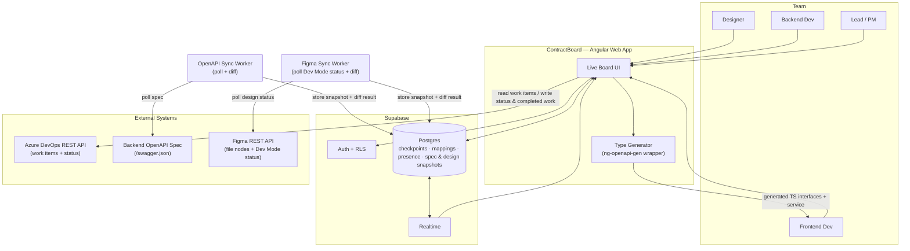
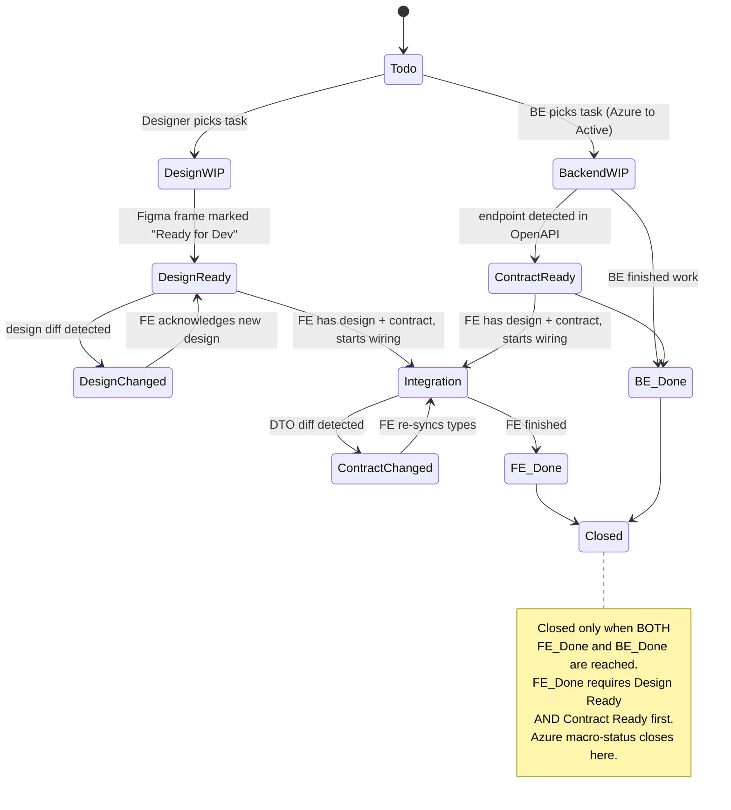
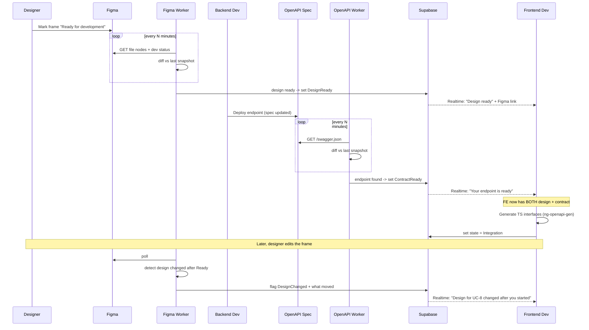
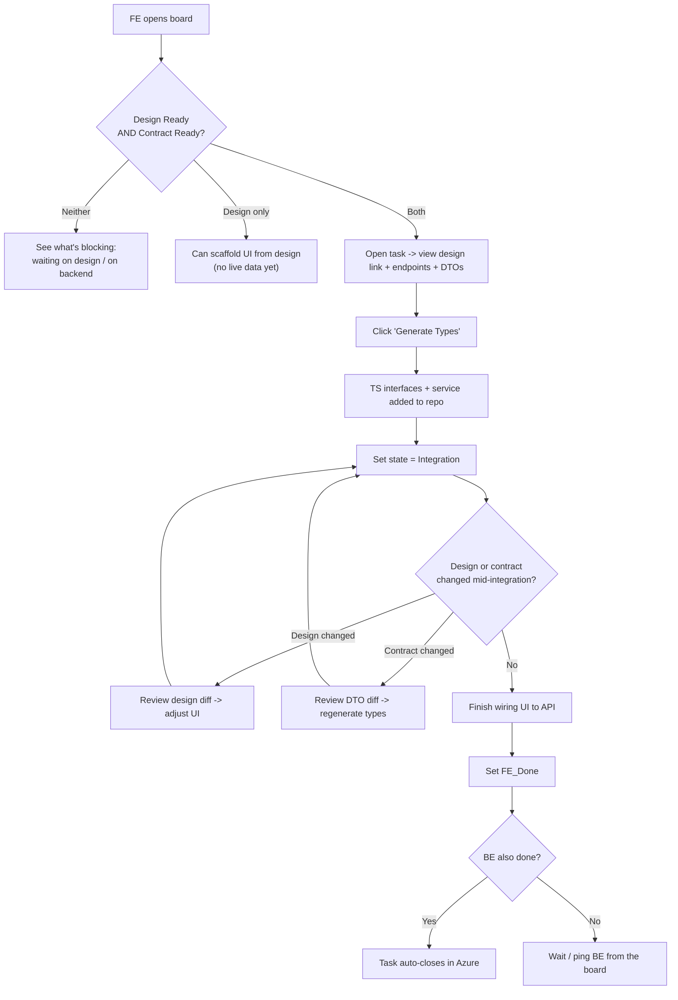
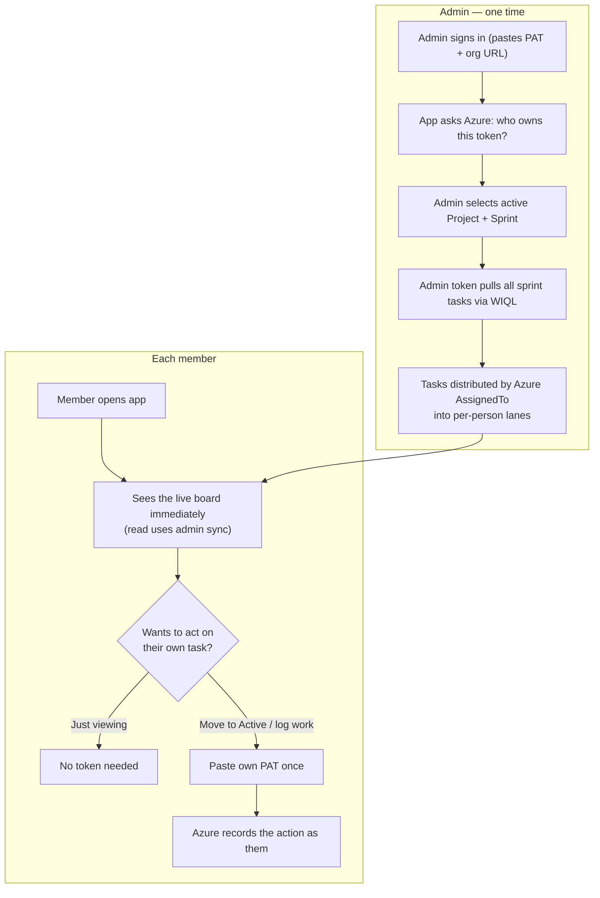

# ContractBoard — Planning Document (v0.3)

> **Working name** — placeholder, change later.
> **In one line:** a live board that sits on top of Figma + Azure DevOps + the backend's OpenAPI spec, and auto-detects three handoff signals — when a **design** is ready for dev, when a backend **contract** (endpoint/DTO) is ready for the frontend, and the macro-status in Azure — so Design, Frontend, and Backend always see what the other tracks have finished.
>
> **الفكرة باختصار:** لوحة حية فوق Figma وAzure DevOps والـ OpenAPI بتاع الباك. بتكتشف لوحدها تلات إشارات تسليم: التصميم خلص وجاهز للفرونت، الـ endpoint/DTO جاهز للفرونت، والـ status في Azure. التلات tracks (Design / Frontend / Backend) كل واحد شايف اللي التانيين خلصوه — من غير ما حد يحدّث حاجة بإيده.
>
> **What changed in v0.2:** added the **Design track** as a first-class lane. The designer is a participant on the board, and "Design Ready" is auto-detected from Figma (Dev Mode "Ready for development"), mirroring the OpenAPI auto-detection philosophy.
>
> **What changed in v0.3:** added the **admin-driven auth & sync model** (admin sets the active Project/Sprint and pulls the board; tasks distribute by Azure's own `AssignedTo`), the **tech stack** (Angular + Nx + Supabase + PWA/desktop), and a **Claude Design brief** for the UI. This version is intended to be handed to Claude Design.

---

## 1. System Architecture



**Key design decisions (from the design discussion):**

- **Two sources of truth, clearly split.** Azure owns the *macro-status* (Active / Resolved / Closed) and Completed Work. Supabase owns the *micro-workflow* (Contract Ready, Integration, FE_Done, BE_Done) and presence — keyed by the Azure work item ID. The tool never invents a parallel status system; it links to Azure.
- **Writes to Azure use the REST API directly, not MCP.** Button presses are deterministic actions, so the plain `wit` REST endpoints are simpler and more reliable than routing through an LLM.
- **Admin-driven sync, per-user writes.** An **admin** sets the active Project/Sprint once and their token pulls the whole board; tasks distribute to people automatically by Azure's own `AssignedTo` field (the admin does *not* hand-assign — Azure stays the source of truth). Each member only needs to add their own PAT when they want to **write** (move their task to Active, log work) so Azure records *who* did it. Reading the board needs only the admin token; acting on your own task needs yours.
- **No passwords, ever.** The app never stores Microsoft account passwords (ROPC is blocked by Entra ID/MFA and is a security liability). Identity is derived from the PAT — the app asks Azure "who owns this token?" — so login = paste token, no password.
- **The OpenAPI spec is the contract source of truth.** "Contract Ready" is *detected* by the worker, not typed in by hand. This is what keeps the board from going stale.
- **Figma is the design source of truth.** "Design Ready" is detected from the Figma Dev Mode "Ready for development" status, not a manual checkbox — same anti-staleness philosophy as the OpenAPI track. A separate Figma Sync Worker polls the linked file and diffs design changes the same way the OpenAPI worker diffs DTOs.

---

## 2. Task Lifecycle — State Machine



**Three tracks, not two.** Design → Frontend → Backend. Design and Backend can run **in parallel** — the backend can build logic while the design is still being finalized; the two only converge at the Frontend, which needs *both* a ready design and a ready contract before it can fully integrate.

---

## 3. User Flow — Core Handoff (Sequence)



---

## 4. User Flow — Frontend Developer Journey



**Role flows in brief:**

- **Designer:** picks task → designs in Figma → marks the frame "Ready for development" → tool detects it and flips the task to *Design Ready* automatically, pushing the Figma link to the FE. If the design changes after that, the tool flags *Design Changed*.
- **Backend dev:** picks task (→ Active in Azure) → works → deploys endpoint → tool detects it and flips the task to *Contract Ready*. BE marks `BE_Done` when logic is complete.
- **Frontend dev:** waits for *both* Design Ready and Contract Ready → pulls types → integrates → handles any design-change or contract-change diffs → marks `FE_Done`.
- **Lead / PM:** opens the board → sees every task across all three lanes, what's finished, who's on each side, and exactly what each task is blocked on — no Azure or Figma spelunking.

---

## 5. Auth & Onboarding (Admin-driven)



**Identity without passwords.** The app never takes a Microsoft password. A PAT is a scoped, expiring key (Work Items only). On sign-in the app calls Azure's "connectionData / profile" endpoint to resolve *who* the token belongs to — that establishes identity. Tokens are stored encrypted in Supabase; a leaked token can be revoked individually and unlocks nothing else.

**Scoping the pull (the part that worried us).** The app never mirrors all of Azure. It walks the hierarchy and filters *at Azure's side* with a WIQL query:

```sql
SELECT [System.Id], [System.Title], [System.State], [System.AssignedTo]
FROM WorkItems
WHERE [System.TeamProject] = 'Project 1'
  AND [System.IterationPath] = 'Project 1\Sprint 3'
  AND [System.WorkItemType] = 'Task'
ORDER BY [System.State]
```

WIQL returns IDs only; a second batched call fetches full details. The board shows the whole sprint across the three lanes (that's the point — everyone sees what the other tracks are doing); `@Me` is used to highlight/filter the current user's own tasks.

**Network reality.** Azure DevOps REST does not allow direct browser (CORS) calls. All Azure traffic goes through a **Supabase Edge Function** acting as a proxy that holds the token server-side. The sync workers live in the same server-side layer.

---

## 6. Tech Stack & Project Shape

| Layer | Choice | Notes |
|-------|--------|-------|
| Frontend | **Angular** (standalone components, signals) | Developer's primary stack |
| Monorepo | **Nx** | `apps/` for the board app; `libs/` for shared UI, Azure client, OpenAPI/Figma sync logic, data-access |
| Backend | **Supabase** | Postgres + Auth + RLS + Realtime + Edge Functions (the Azure/Figma/OpenAPI proxies & workers) |
| Realtime | **Supabase Realtime** | Live board updates, checkpoint transitions, notifications |
| Desktop / installable | **PWA** | `@angular/pwa`, service worker, manifest → installable on desktop & mobile; one codebase, no Electron needed for v1 |
| Type generation | **ng-openapi-gen** (wrapped) | Generates TS interfaces + Angular services from the OpenAPI spec |

**Suggested Nx layout:**

```
apps/
  board/                  # the Angular PWA
libs/
  ui/                     # presentational board components (lanes, cards, badges)
  data-access/            # Supabase client, queries, realtime subscriptions
  azure/                  # WIQL builder, work-item client (talks to Edge Function)
  openapi-sync/           # spec polling + diff logic
  figma-sync/             # design status polling + diff logic
  feature-board/          # smart components / state for the board screen
  feature-auth/           # token onboarding, identity resolution
supabase/
  functions/              # azure-proxy, openapi-worker, figma-worker
  migrations/             # schema
```

**Why PWA over Electron for v1:** an installable PWA gives a desktop app feel (own window, offline shell, push) from the same Angular build, with zero extra packaging. Electron stays an option later only if the app needs deep OS integration it can't get from a PWA.

---

## 7. Claude Design Brief (UI)

**Goal:** design the screens for an installable, dark-mode-first internal tool used daily by a small product team (Designer, Frontend, Backend, Lead/PM).

**Screens to design:**

1. **Sign in** — org URL + access token (PAT) only. Identity comes from the token, not a role picker. A short, calm screen; reassure that no password is stored and sessions are RLS-scoped.
2. **First-run role select** — one-time, after first sign-in: "What's your role?" (Designer / FE / BE / Lead-PM). Sets the board lens, not access.
3. **Admin setup** — pick active Project + Sprint (dropdowns sourced from Azure). Shown only to the admin.
4. **The Board (primary screen)** — the heart of the app. A task is a card; each card shows its three lanes (Design / FE / BE) and their live state (WIP / Ready / Changed / Done). The board makes "what's blocking what" obvious at a glance. Filter to `@Me`. Live-updating.
5. **Task detail** — design link (Figma) + endpoints/DTOs + a "Generate Types" action + the per-lane state controls. Shows diffs when design or contract changed after the FE started.
6. **Notifications / activity** — realtime feed: "design ready", "endpoint ready", "DTO changed", etc.

**Design principles:**

- Dark-mode-first, calm, low-chrome — a tool people stare at all day. (The current sign-in mock's palette/tone is the right direction.)
- The **three-lane state** per task is the signature visual — invest there. State should be readable by color + label, never color alone (accessibility).
- "Blocked / waiting on X" should be as visible as "done".
- Installable/desktop framing: design for a resizable window, not a fixed mobile width.

---

## 8. Test Cases

| ID | Area | Scenario | Expected result |
|----|------|----------|-----------------|
| TC-01 | Auth | User logs in with their own Azure credentials | Session created; subsequent Azure writes are attributed to that user |
| TC-02 | Auth / RLS | User A tries to read User B's private presence rows | Blocked by Supabase RLS |
| TC-03 | Azure sync | Board loads tasks assigned to the team | Work items pulled from Azure with correct IDs, titles, macro-status |
| TC-04 | Mapping | A task is linked to OpenAPI operation(s) via convention (tag/operationId contains UC number) | Tool auto-maps task ↔ endpoint with no manual step |
| TC-05 | Mapping | A task has no detectable convention | Tool prompts for a one-time manual mapping; no crash |
| TC-06 | OpenAPI poll | Worker polls spec on schedule | Latest snapshot stored; timestamp updated |
| TC-07 | Contract-ready detection | A mapped endpoint appears in the spec for the first time | Task transitions to `ContractReady`; FE owner notified via Realtime |
| TC-08 | Contract-ready (negative) | Endpoint still absent from spec | Task stays `BackendWIP`; no false "ready" notification |
| TC-09 | DTO diff | A field is removed from a DTO during integration | Task flagged `ContractChanged`; diff shows the removed field |
| TC-10 | DTO diff | A field type changes (e.g. `string` → `number`) | Diff shows type change; FE notified |
| TC-11 | DTO diff (negative) | Spec re-polled with no changes | No diff event; no spurious notification |
| TC-12 | Type generation | FE clicks "Generate Types" | Valid TS interfaces + Angular service produced from the current DTO |
| TC-13 | State transition | FE marks `FE_Done` while BE is still working | Task stays open; `Closed` is NOT reached |
| TC-14 | Two-track done | Both `FE_Done` and `BE_Done` are set | Task transitions to `Closed`; Azure macro-status updated to Closed |
| TC-15 | Azure write-back | Completed Work is written to a task | Value is **added** to (not overwriting) existing estimate field |
| TC-16 | Realtime board | A task changes state | All connected boards update live without manual refresh |
| TC-17 | Multi-environment | Endpoint exists in `dev` spec but not `staging` | Tool reflects the configured target environment only |
| TC-18 | Resilience | OpenAPI endpoint is unreachable | Worker logs failure, keeps last snapshot, surfaces a "spec stale" warning — no false state changes |
| TC-19 | Resilience | Spec returns malformed JSON | Worker skips the cycle gracefully; alerts maintainer |
| TC-20 | Permissions | A non-owner tries to set `FE_Done` on someone else's side | Action blocked or requires confirmation, per policy |
| TC-21 | Design mapping | A task is linked to a Figma frame via convention (frame/page name contains UC number) | Tool auto-maps task ↔ frame with no manual step |
| TC-22 | Design-ready detection | Linked frame is marked "Ready for development" in Figma Dev Mode | Task transitions to `DesignReady`; FE notified with the Figma link |
| TC-23 | Design-ready (negative) | Frame is still in progress / not marked ready | Task stays `DesignWIP`; no false "design ready" notification |
| TC-24 | Design diff | Designer edits the frame after it was marked ready | Task flagged `DesignChanged`; FE notified the design moved |
| TC-25 | FE gate | FE tries to reach `Integration` with Contract Ready but design still WIP | FE sees a partial state (can scaffold), full integration gate not satisfied |
| TC-26 | Figma access | Figma API token is missing/expired | Worker surfaces an auth warning; design track shows "unknown", other tracks unaffected |
| TC-27 | Parallel tracks | Design and Backend complete at different times | Board shows each lane's true state independently; no lane blocks the other prematurely |
| TC-28 | Admin sync | Admin sets Project 1 / Sprint 3 and pulls the board | All sprint tasks load, distributed by Azure `AssignedTo` into the right people's lanes |
| TC-29 | Member read | A member opens the app without adding their own PAT | They can view the full board (read via admin sync); write controls are disabled/prompt for token |
| TC-30 | Per-user write | A member with their own PAT moves their task to Active | Azure records the change under that member's identity, not the admin's |
| TC-31 | Token identity | A PAT is pasted on sign-in | App resolves the correct owner identity from Azure; mismatched/expired token is rejected gracefully |
| TC-32 | PWA install | User installs the app to desktop | App launches in its own window; offline shell loads; live data resumes on reconnect |

---

## 9. Assumptions & Open Questions

1. **Mapping convention** — relies on the backend embedding the UC / work-item number in an OpenAPI `tag` or `operationId`. *Needs BE buy-in.* Fallback = manual one-time mapping per task.
2. **Target environment** — which spec does the worker watch (dev / staging)? Default assumption: the integration environment, not prod.
3. **Spec access** — is `/swagger.json` reachable from where the worker runs (auth / VPN / network)? Worker may need credentials.
4. **Completed Work field** — write strategy is *additive* or a separate custom field, to avoid clobbering PM estimates (`Microsoft.VSTS.Scheduling.*`).
5. **The contract is technical, not behavioral** — OpenAPI describes shape, not business rules (nullability-by-role, side effects). The tool reduces FE↔BE chatter; it does not eliminate it.
6. **Design ↔ task mapping** — relies on the designer embedding the UC / work-item number in the Figma frame or page name. *Needs designer buy-in.* Fallback = manual one-time link per task.
7. **"Design Ready" is a soft signal** — a designer can mark "Ready for Dev" and later edit it. Design diffing is harder than OpenAPI diffing (no clean JSON contract to compare); v1 relies on Figma's `lastModified` / version history at the node level rather than a pixel-level diff.
8. **Figma API access** — the worker needs a Figma token with read access to the relevant team/file.
9. **Admin token scope** — the admin's PAT must have read access to the team's work items. If team members are in different Azure security groups, confirm the admin can read all sprint tasks.
10. **Write attribution** — a member must add their own PAT before performing write actions; until then they are read-only. Decide whether read-only members can set micro-states (Supabase-only) without an Azure write.

---

## 10. Suggested MVP Cut

Live board (tasks from Azure) → **three lanes (Design / FE / BE)** → auto *Design Ready* detection from Figma + auto *Contract Ready* detection from OpenAPI → design-change and DTO-change notifications → one-click type generation → `FE_Done` / `BE_Done` micro-states in Supabase, with macro-status synced to Azure.

Build order suggestion: (1) Azure task sync + board, (2) OpenAPI track (your own pain, fastest to validate), (3) Figma/design track, (4) type generation, (5) later: presence + weekly LLM digest.
